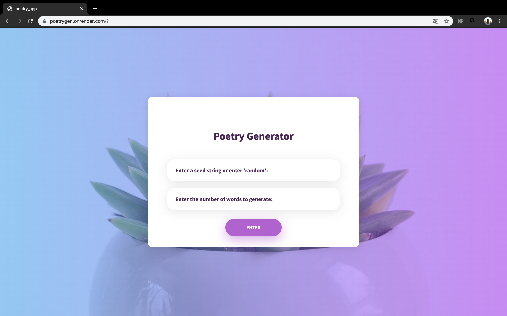

# Poetrygen
Webapp that generates poems based on a seed string and a number of words. The webapp is made in Flask and uses fastai to predict text from  a previously generated deep learning model ([github](https://github.com/b-lusse/Deep_learning_interference)). [Render.com](https://render.com/) is used to deploy the app. 

The predictions are not the best, but can be quite funny at times. 

#### The app can be found at https://poetrygen.onrender.com/. 

### Lay-out

### References

Inspired by:
1. Koehrsen, W. Deploying a Keras Deep Learning Model as a Web Application in Python [article](https://towardsdatascience.com/deploying-a-keras-deep-learning-model-as-a-web-application-in-p-fc0f2354a7ff)/[github](https://github.com/WillKoehrsen/recurrent-neural-networks)
2. Colorlib html template [link](https://colorlib.com/wp/template/login-form-v9/)

